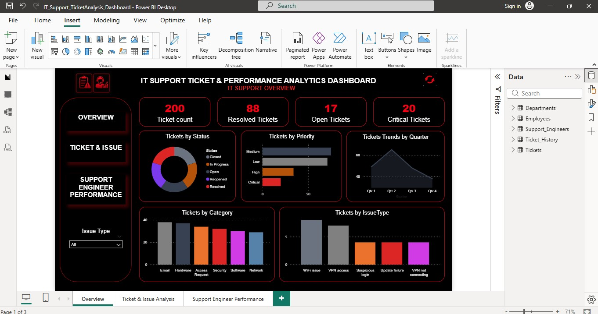
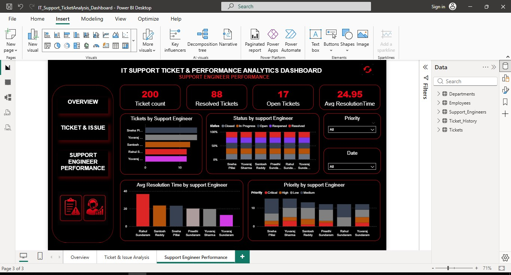

# IT Support Ticket & Performance Analytics Dashboard

## Project Overview

The **IT Support Ticket & Performance Analytics Dashboard** is an interactive Power BI project designed to analyze IT support operations, ticket trends, issue patterns, resolution performance, and Support Engineer performance.

The project transforms raw IT support data into meaningful insights using **MySQL, Power Query, Power BI, and DAX**.

---

## Project Objectives

- Analyze overall IT support ticket volume
- Monitor ticket status and priority
- Identify frequently reported issue types and categories
- Analyze ticket trends over time
- Calculate Average Resolution Time
- Evaluate Support Engineer performance
- Create an interactive and professional Power BI dashboard
- Support data-driven decision-making

---

## Dataset

The project contains five related tables:

- Departments
- Employees
- Support Engineers
- Tickets
- Ticket History

### Main Tickets Fields

- TicketID
- EmployeeID
- Category
- Priority
- IssueType
- CreatedDate
- ResolvedDate
- Status
- AssignedTo
- ResolutionTimeHours

---

## Tools & Technologies

| Tool | Purpose |
|------|---------|
| MySQL | Data analysis, queries, joins and validation |
| Power Query | Data cleaning and transformation |
| Power BI | Dashboard and data visualization |
| DAX | Measures and KPI calculations |
| CSV | Source datasets |

---

## Project Workflow

CSV Data
    ↓
Data Validation
    ↓
MySQL Analysis
    ↓
Power Query
    ↓
Data Modeling
    ↓
DAX Measures
    ↓
Power BI Visualizations
    ↓
Interactive Dashboard

---

## Dashboard Pages

### Overview

### Tickets & IssueType

### Support Enginner

### IT Support Overview

Provides a high-level summary of IT support operations.

- KPI Cards
- Total Tickets
- Open Tickets
- Resolved Tickets
- Average Resolution Time
- Visualizations
- Tickets Trend Over Time
- Tickets by Status
- Tickets by Priority
- Tickets by Department
  
---

## Ticket & Issue Analysis

Focuses on identifying and analyzing common support issues.

- Visualizations
- Tickets by Issue Type
- Issue Type by Status
- Issue Type by Priority
- Issue Details Table
- Slicers
- Date
- Priority
- Category
- Issue Details Table
- Ticket ID
- Issue Type
- Category
- Priority
- Status
- Created Date
- Resolution Time (Hours)

---
  
## Support Engineer Performance

Analyzes ticket workload and resolution performance by Support Engineer.

- KPI Cards
- Total Tickets
- Resolved Tickets
- Open Tickets
- Average Resolution Time
- Visualizations
- Tickets by Support Engineer
- Status by Support Engineer
- Average Resolution Time by Support Engineer
- Priority by Support Engineer
- Engineer Performance Table
- Support Engineer
- Total Tickets
- Resolved Tickets
- Open Tickets
- Average Resolution Time

---

## Key DAX Measures

### Total Tickets
Total Tickets =
COUNT(Tickets[TicketID])

### Resolved Tickets
Resolved Tickets =
CALCULATE(
    COUNT(Tickets[TicketID]),
    Tickets[Status] = "Resolved")

### Open Tickets
Open Tickets =
CALCULATE(
    COUNT(Tickets[TicketID]),
    Tickets[Status] = "Open")
    
### Average Resolution Time
Avg Resolution Time =
AVERAGE(Tickets[ResolutionTimeHours])

---

## Key Analysis

The dashboard provides insights into:

- Overall support workload
- Ticket status distribution
- Priority-wise ticket volume
- Common issue types
- Category-wise ticket patterns
- Ticket trends over time
- Average resolution time
- Support Engineer workload
- Engineer-wise resolution performance

---

## Dashboard Design

The dashboard uses a professional Black & Red theme.

- Features
- KPI Cards
- Interactive Charts
- Slicers
- Cross-filtering
- Detailed Tables
- Page Navigation

---

## Business Value

This dashboard helps IT support teams to:

- Monitor ticket workload
- Identify recurring issues
- Track unresolved tickets
- Monitor resolution efficiency
- Understand priority distribution
- Compare Support Engineer performance
- Identify areas for operational improvement
- Make data-driven decisions

---

## Skills Demonstrated

SQL | MySQL | Power BI | Power Query | DAX | Data Cleaning | Data Modeling | Data Visualization | KPI Development | Dashboard Development | Business Analysis

## Author
Subasri R
Aspiring Data Analyst | Power BI | SQL | Excel | Python
